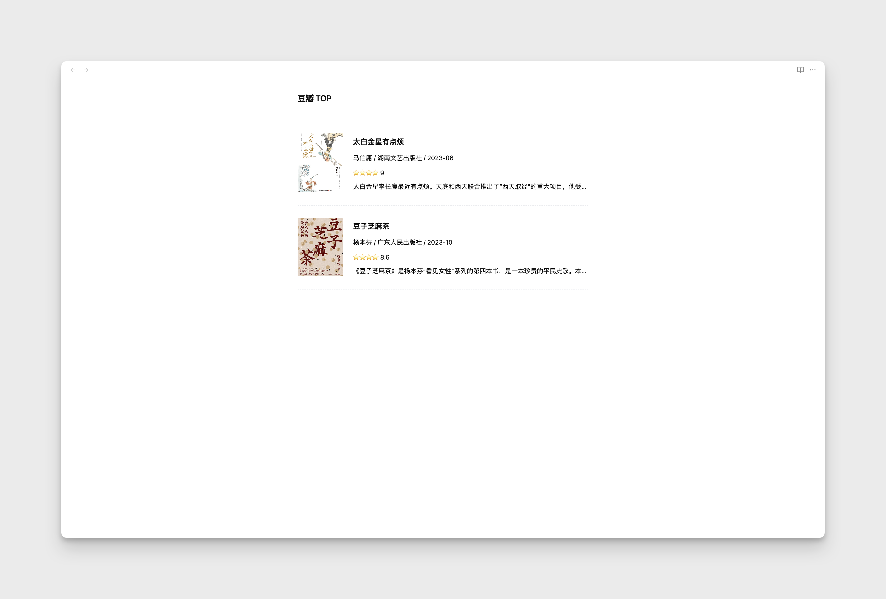
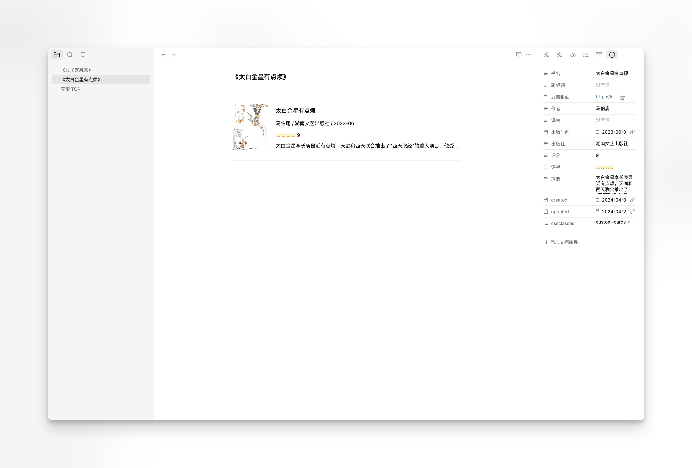
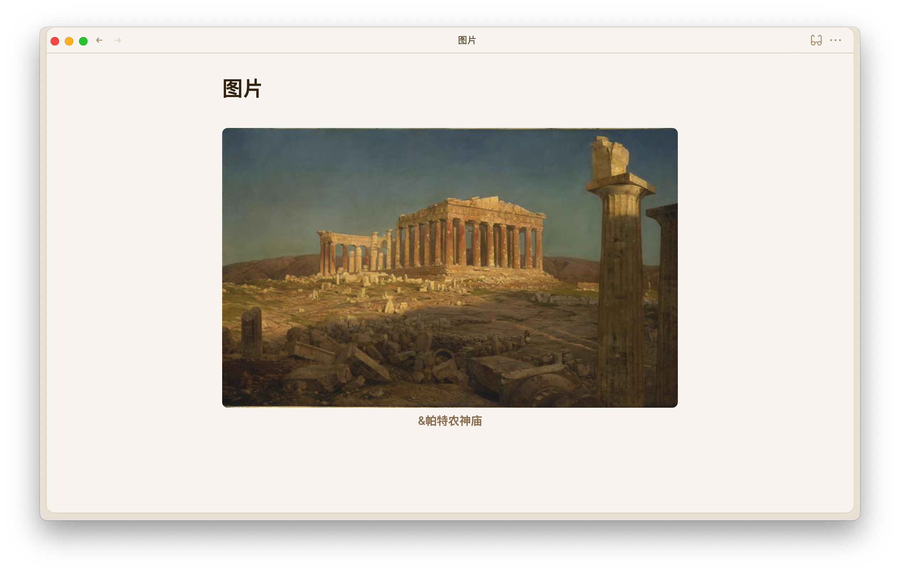

# 💎 obsidian 使用

 

> 简洁，易用

## 001 书籍卡片（豆瓣样式）

### 书籍卡片清单



### 当前书籍卡片



### 使用

下载 [001 card](./001%20card/) 库，在 obsidian 中打开即可

## 002 图片描述展示


### 说明

图片描述中 & 开头的内容会被显示在图片下方

markdown 写法如下

```markdown
![[preview.png|&图片描述]]

```

显示效果如下



### 使用

下载 [002 image-alt](./002%20image-alt) 库，在 obsidian 中打开即可，或者直接使用代码片段

所有 & 开头的描述都会显示在图片下方
```css
.internal-embed.media-embed.image-embed.is-loaded[alt^="&"]::after {
    content: attr(alt);
    text-align: center;
    color: var(--text-accent);
    display: block;
    margin-bottom: 1.5em;
}
```

如果希望所有的图片都能显示描述
可以使用如下 css
```css
.internal-embed.media-embed.image-embed.is-loaded[alt]::after {
    content: attr(alt);
    text-align: center;
    color: var(--text-accent);
    display: block;
    margin-bottom: 1.5em;
}
```
